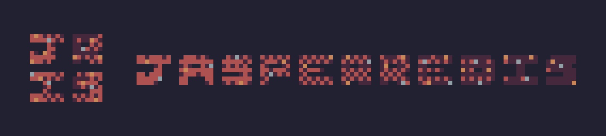

 
Hello! I'm jasperredis (or jris), a small programmer (and pixel artist) with several goals, and a long way to get there. 
https://jris.straw.page -- Main Website 

  Plan to Learn: 
  

## My (Published) Projects
###  Lifeline.py
Lifeline.py is a retro-style endless game made in Pygame where you control a small white line on a bar. Your health depletes, and green spots (and red) randomly generate across it. Green heals you, red takes away even more health. The longer you survive, the higher your score ends up.  
https://jasperredis.github.io/Lifeline.py  
https://github.com/Jasperredis/Lifeline.py

### Cerbose
Cerbose is a simple, easy-to-use Python library for tagged, feature-rich terminal output that can be logged. It also includes additional features such as cerbar, an ASCII progress bar generator, and cin, a terminal user-input tool.  
https://jasperredis.github.io/cerbose  
https://github.com/Jasperredis/cerbose-lib

Unfortunately, that's all as of right now.

### Currently Working On
Ranked by my decided importance.
1. Lifeline.PYR: A complete rewrite of Lifeline.py.
2. Fishgame by jasperredis: A text adventure game in JS/CSS/HTML about a fish the player found on the ground.
3. TrivialFrog: A program that when installed, randomly gives popups to the user containing frog trivia that must be answered correctly to dismiss.

### About Me
- I use Arch Linux and absolutely swear by the modern world needing more Linux.
- I use mostly open-source software and believe it is the future of programming.
- Tabs are better than spaces. 
- I really like frogs. Admittedly, I don't know why I like them.
- I currently use a Lenovo IdeaPad Gaming 3, however I plan to build a PC later this year.
- I really like coding. Especially in programming languages with several use cases.

### Licenses
While I don't have very many projects to showcase it (☹️), most or all projects will go under the **MIT License**, **GNU GPLv3**, or **GNU LGPLv3**.

### Priorities
- Projects are **LINUX-FIRST**.
- I don't have much else to put here yet.

### Contact Me  
If for some weird reason you want to contact me, reach out on [Twitter](https://x.com/jasperredis) or more preferably Discord to @jasperredis (please dont spam me).

---

  So supposedly people like these statistics, so I decided I might as well put them here.
   
  

