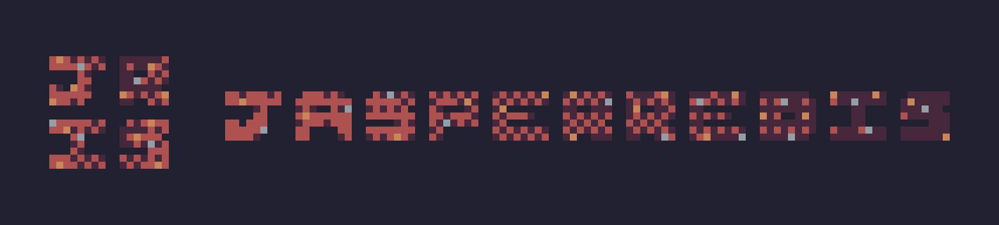

 
it is I, jasper 
https://jris.straw.page

My repositories are cool please look star and contribute maybe pretty please  

#### Project Info
I use Python, primarily, and sometimes JavaScript but I've yet to actually publish anything in JS. I plan on learning C and Rust :3  
I make games, libraries, CLI apps, and some other stuff, really just whatever I feel like making.  
Everything I make is Linux-first. I will still account for Windows, but. yk.

#### Licensing
Almost all of my work is to be under either the GPLv3 (or other GNU licenses) or the MIT License.

#### Contacting
Contact me at jasperredisispublic@gmail.com.

#### Updates
See [Cerbose](https://github.com/Jasperredis/cerbose), I released v2.0.0!!!!

#### Some WIP Projects
I start and end new WIP projects all of the time, so this is **not** a concrete list.
- **DATS 2**: A web game where you are talking to an intelligent computer and choose dialogue options.
- **Lifeline.PYR**: A complete rewrite of Lifeline.py (which is terrible, btw) with better assets, way more features, better code, and a website that isn't broken.
- **Glanzquiz**: A CLI quizzing program in Python.
- A lot more :P

  <strong>stats, since those are nice</strong> (i doubt they work)  
  
  
  

